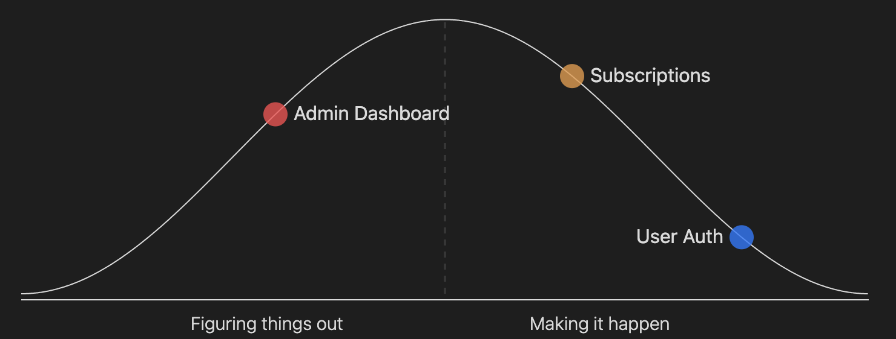

# Obsidian Hill Charts
<a href="https://www.buymeacoffee.com/stuartfrosg" target="_blank"></a>
[](https://github.com/stufro/obsidian-hill-charts/blob/main/LICENSE.txt)


An Obsidian plugin for adding hill charts to your notes.

- Create hill charts inline by writing a tiny bit of YAML.
- Customizable styles and sizes
- [What is a hill chart?](https://www.hillchart.co/blog/hill-chart-guide/)



## Installation
You can install this plugin using the [Obsidian BRAT](https://github.com/TfTHacker/obsidian42-brat) plugin.

## Usage
Once installed, you can define a hillchart in a code block like this:

```
```hillchart
points:
  - position: 30
    text: Admin Dashboard
  - position: 85
    text: User Auth
  - position: 65
    text: Subscriptions
 ```
```

There are 5 available options you can pass to each point:
```
- position: 30
  text: Admin Dashboard
  color: "#fb3590"
  size: 15
  opacity: 0.5
```

The default size and opacity can be configured in the plugin settings.

## Contributing
You can follow the [Obsidian instructions](https://docs.obsidian.md/Plugins/Getting+started/Build+a+plugin) for setting up a plugin in a development vault, swapping the git clone command for this repo instead of the sample plugin.

If you want to fix a bug or add a new feature, please:

1. [Fork the project](https://docs.github.com/en/pull-requests/collaborating-with-pull-requests/working-with-forks/about-forks).
2. Create a feature branch (`git checkout -b my-new-feature`).
3. Make your changes. Include tests for your changes, otherwise I may accidentally break them in the future.
4. Run the tests with the `npm exec jest` command. Make sure that they are still passing.
5. Write [descriptive commit messages](https://tbaggery.com/2008/04/19/a-note-about-git-commit-messages.html).
6. Push the branch to GitHub (`git push origin my-new-feature`).
7. [Create a Pull Request](https://docs.github.com/en/pull-requests/collaborating-with-pull-requests/proposing-changes-to-your-work-with-pull-requests/creating-a-pull-request) and submit it to be merged with the main branch.

### Releasing
```
npm version [patch|minor|major]
git push origin master --tags
```

## Credits
- https://github.com/nagi1/hill-chart